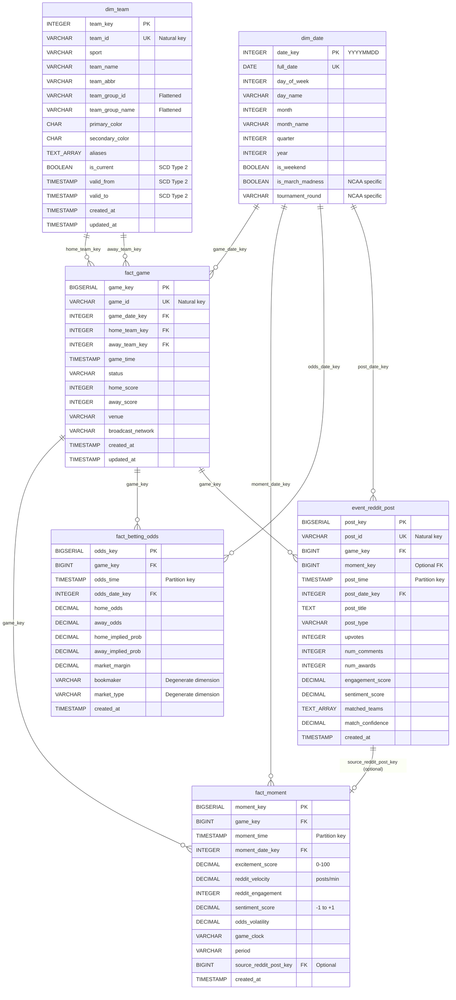

# GamePulse Database Schema Reference

**Version:** 1.0
**Last Updated:** 2025-11-11
**Database:** PostgreSQL 16 + TimescaleDB 2.14
**Schema Pattern:** Kimball Dimensional Model + Time-Series Facts + Event Streams

---

## Table of Contents

1. [Architecture Overview](#architecture-overview)
2. [Entity Relationship Diagram](#entity-relationship-diagram)
3. [Dimension Tables](#dimension-tables)
4. [Fact Tables](#fact-tables)
5. [Event Stream Tables](#event-stream-tables)
6. [Grain Definitions](#grain-definitions)
7. [Complete DDL Reference](#complete-ddl-reference)
8. [Sample Queries](#sample-queries)
9. [Migration History](#migration-history)
10. [Portfolio Interview Talking Points](#portfolio-interview-talking-points)

---

## Architecture Overview

GamePulse implements a **hybrid dimensional + time-series architecture** optimized for real-time sports analytics:

- **Dimensional Core**: Kimball star schema with surrogate keys (dim_team, dim_date)
- **Time-Series Facts**: TimescaleDB hypertables for high-velocity writes (fact_moment, fact_betting_odds)
- **Event Streams**: Semi-structured event logs with optional fact table joins (event_reddit_post)

**Key Design Principles:**

1. **Surrogate Keys**: All dimensions use auto-increment integer surrogate keys (team_key, game_key)
2. **Natural Keys**: Preserved with UNIQUE constraints for idempotent upserts (team_id, game_id)
3. **Strategic Denormalization**: team_group flattened into dim_team (6 conferences, minimal attributes)
4. **SCD Type 2 Ready**: Dimensions include is_current, valid_from, valid_to for historical tracking
5. **TimescaleDB Partitioning**: Automatic time-based partitioning for fact tables

**Data Volume Expectations:**

- dim_team: ~350 rows (NCAA Division I teams)
- dim_date: ~1,095 rows (3 years)
- fact_game: ~5,500 rows/year (~350 teams × ~30 games / 2)
- fact_moment: ~165,000 rows/year (30 moments/game)
- fact_betting_odds: ~2.5M rows/year (500 updates/game)
- event_reddit_post: ~55,000 rows/year (10 posts/game)

**Total Season Volume**: ~60MB (compressed with TimescaleDB)

---

## Entity Relationship Diagram



---

## Dimension Tables

### dim_team

**Purpose:** Type 2 Slowly Changing Dimension for NCAA teams with flattened conference/league membership.

**Key Characteristics:**
- Surrogate key (team_key) enables SCD Type 2 tracking
- Natural key (team_id) preserved for API integration and idempotency
- Strategic denormalization: team_group_id, team_group_name flattened (avoids JOIN overhead for 6 conferences)
- Multi-sport extensibility: sport column supports expansion beyond NCAA basketball
- UI metadata: primary_color, secondary_color for frontend branding
- Reddit matching: aliases array for fuzzy text matching (["Duke", "Blue Devils"])

**SCD Type 2 Fields:**
- `is_current`: TRUE for active row, FALSE for historical
- `valid_from`: Effective start date
- `valid_to`: Effective end date (NULL = current)

**Indexes:**
- PRIMARY KEY: team_key (clustered)
- UNIQUE: team_id (for upserts)
- INDEX: is_current (filter for current dimensions)
- INDEX: team_group_id (conference queries)

### dim_date

**Purpose:** Date dimension with NCAA tournament-specific metadata.

**Key Characteristics:**
- Surrogate key format: YYYYMMDD integer (e.g., 20250311)
- Standard Kimball attributes: day_of_week, month_name, quarter, year
- NCAA-specific: is_march_madness, tournament_round
- Seeded for 2024-2026 (1,095 rows, ~50KB)

**Special Attributes:**
- `is_march_madness`: TRUE mid-March to early April
- `tournament_round`: "First Four", "Round of 64", "Sweet 16", "Elite 8", "Final Four", "Championship"

**Indexes:**
- PRIMARY KEY: date_key
- UNIQUE: full_date
- INDEX: is_march_madness (tournament queries)
- INDEX: year, month (time-based aggregations)

---

## Fact Tables

### fact_game

**Purpose:** Transactional fact table for completed/scheduled NCAA games.

**Grain:** One row per game (home team vs away team at a specific date/time).

**Key Characteristics:**
- Surrogate key (game_key) for foreign key relationships
- Natural key (game_id) from NCAA API (e.g., "401585678")
- Conformed dimensions: game_date_key → dim_date, home/away_team_key → dim_team
- Low-cardinality degenerate dimensions: status, broadcast_network
- No TimescaleDB partitioning (low write volume: ~5,500 rows/year)

**Measures:**
- home_score, away_score (additive)

**Indexes:**
- PRIMARY KEY: game_key
- UNIQUE: game_id
- INDEX: game_date_key, status (dashboard queries)
- INDEX: home_team_key, away_team_key (team-level aggregations)

### fact_moment

**Purpose:** Time-series fact table for real-time excitement moments during games.

**Grain:** One row per detected excitement moment (1-second resolution).

**Key Characteristics:**
- TimescaleDB hypertable partitioned by moment_time (1-day chunks)
- High write volume: ~165,000 rows/year (30 moments/game × 5,500 games)
- Multi-factor excitement algorithm: reddit_velocity, sentiment_score, odds_volatility
- Optional source attribution: source_reddit_post_key links to triggering Reddit post

**Measures:**
- excitement_score: 0-100 composite score (additive for aggregation)
- reddit_velocity: posts/minute (intensive)
- reddit_engagement: total upvotes + comments (additive)
- sentiment_score: -1 to +1 VADER composite (semi-additive)
- odds_volatility: Betfair odds movement (intensive)

**Partitioning Strategy:**
```sql
-- Automatic 1-day partitions via TimescaleDB
SELECT create_hypertable('fact_moment', 'moment_time', chunk_time_interval => INTERVAL '1 day');
```

**Indexes:**
- PRIMARY KEY: (game_key, moment_time) - composite natural key
- INDEX: moment_key (surrogate key for optional use)
- INDEX: excitement_score DESC (top moments queries)
- INDEX: moment_date_key (time-based aggregations)

### fact_betting_odds

**Purpose:** Time-series fact table for streaming Betfair odds updates.

**Grain:** One row per odds update for a game/bookmaker/market combination (real-time updates).

**Key Characteristics:**
- TimescaleDB hypertable partitioned by odds_time (1-hour chunks for high-velocity writes)
- Very high write volume: ~2.5M rows/year (500 updates/game × 5,500 games)
- Degenerate dimensions: bookmaker (e.g., "Betfair"), market_type (e.g., "moneyline")
- Derived measures: home/away_implied_prob, market_margin (calculated from odds)

**Measures:**
- home_odds, away_odds: decimal odds (intensive, use latest value)
- home_implied_prob, away_implied_prob: 0-1 probability (intensive)
- market_margin: bookmaker profit margin (intensive)

**Partitioning Strategy:**
```sql
-- Automatic 1-hour partitions for high-velocity streaming data
SELECT create_hypertable('fact_betting_odds', 'odds_time', chunk_time_interval => INTERVAL '1 hour');
```

**Indexes:**
- PRIMARY KEY: (game_key, odds_time, bookmaker, market_type) - composite natural key
- INDEX: odds_key (surrogate key for optional use)
- INDEX: game_key, odds_time DESC (latest odds queries)

---

## Event Stream Tables

### event_reddit_post

**Purpose:** Semi-structured event log for Reddit posts with optional game/moment attribution.

**Grain:** One row per Reddit post (subreddit submission).

**Key Characteristics:**
- **event_ prefix** (not fact_): Denotes semi-structured event stream
- TimescaleDB hypertable partitioned by post_time (1-day chunks)
- Optional foreign keys: game_key (fuzzy matched), moment_key (derived later)
- Text analytics: sentiment_score (VADER), matched_teams (fuzzy match), match_confidence
- Engagement metrics: upvotes, num_comments, num_awards, engagement_score

**Why Event Stream vs Fact Table?**
- Semi-structured data (post_title, variable attributes)
- Many-to-many relationship with games (one post can reference multiple games)
- Fuzzy matching logic (not guaranteed 1:1 with games)
- Late-arriving attribution (moment_key derived post-ingestion)

**Indexes:**
- PRIMARY KEY: post_key
- UNIQUE: post_id (Reddit unique identifier)
- INDEX: game_key (game-level aggregations)
- INDEX: post_time DESC (recent posts)
- INDEX: engagement_score DESC (trending posts)

---

## Grain Definitions

| Table | Grain | Example Row Represents |
|-------|-------|----------------------|
| **dim_team** | One row per team per valid period | Duke Blue Devils as member of ACC from 2024-07-01 to NULL (current) |
| **dim_date** | One row per calendar date | March 11, 2025 (Sweet 16, Monday, Q1, is_weekend=FALSE) |
| **fact_game** | One row per game | Duke vs UNC on 2025-03-11 at 9:00 PM EST (game_id: "401585678") |
| **fact_moment** | One row per excitement moment | Excitement score of 87.3 at 2025-03-11 21:34:12 during Duke vs UNC game |
| **fact_betting_odds** | One row per odds update | Betfair moneyline odds updated to Duke -150 / UNC +130 at 2025-03-11 21:34:05 |
| **event_reddit_post** | One row per Reddit post | r/CollegeBasketball post "GAME THREAD: Duke @ UNC" at 2025-03-11 19:00:00 |

**Grain Precision Notes:**

- **fact_game**: Grain is uniquely defined by game_id (natural key). One game = one row.
- **fact_moment**: Grain is (game_key, moment_time). Multiple moments can occur per game, one per second.
- **fact_betting_odds**: Grain is (game_key, odds_time, bookmaker, market_type). Same game can have multiple odds updates per second from different bookmakers.
- **event_reddit_post**: Grain is post_id (Reddit unique identifier). One post = one row, regardless of game association.

---

## Complete DDL Reference

### Dimension Tables DDL

```sql
-- ============================================================================
-- dim_team: Type 2 SCD for NCAA teams with flattened conference membership
-- ============================================================================
CREATE TABLE dim_team (
    -- Surrogate key (auto-increment)
    team_key SERIAL PRIMARY KEY,

    -- Natural key (from NCAA API)
    team_id VARCHAR(50) UNIQUE NOT NULL,

    -- Team attributes
    sport VARCHAR(20) NOT NULL,                    -- "ncaam", "nfl", "nba"
    team_name VARCHAR(100),                        -- "Duke Blue Devils"
    team_abbr VARCHAR(10),                         -- "DUKE"

    -- Flattened team_group (denormalized for performance)
    team_group_id VARCHAR(50),                     -- "ncaam_acc"
    team_group_name VARCHAR(100),                  -- "Atlantic Coast Conference"

    -- UI metadata
    primary_color CHAR(7),                         -- "#003087" (Duke blue)
    secondary_color CHAR(7),                       -- "#FFFFFF"

    -- Reddit fuzzy matching
    aliases TEXT[],                                -- ["Duke", "Blue Devils", "Dukies"]

    -- SCD Type 2 fields (for conference realignment tracking)
    is_current BOOLEAN DEFAULT TRUE,               -- Current version?
    valid_from TIMESTAMP DEFAULT NOW(),            -- Effective start date
    valid_to TIMESTAMP DEFAULT NULL,               -- Effective end date (NULL = current)

    -- Audit fields
    created_at TIMESTAMP DEFAULT NOW(),
    updated_at TIMESTAMP DEFAULT NOW()
);

-- Indexes for dim_team
CREATE INDEX idx_dim_team_is_current ON dim_team(is_current);
CREATE INDEX idx_dim_team_team_group_id ON dim_team(team_group_id);
CREATE INDEX idx_dim_team_sport ON dim_team(sport);


-- ============================================================================
-- dim_date: Date dimension with NCAA tournament metadata
-- ============================================================================
CREATE TABLE dim_date (
    -- Surrogate key (YYYYMMDD integer format)
    date_key INTEGER PRIMARY KEY,                  -- 20250311

    -- Date attributes
    full_date DATE UNIQUE NOT NULL,                -- 2025-03-11
    day_of_week INTEGER,                           -- 1-7 (Monday=1)
    day_name VARCHAR(10),                          -- "Monday"
    month INTEGER,                                 -- 1-12
    month_name VARCHAR(10),                        -- "March"
    quarter INTEGER,                               -- 1-4
    year INTEGER,                                  -- 2025
    is_weekend BOOLEAN,                            -- FALSE

    -- NCAA-specific attributes
    is_march_madness BOOLEAN,                      -- TRUE mid-March to early April
    tournament_round VARCHAR(50)                   -- "Sweet 16", "Elite 8", NULL
);

-- Indexes for dim_date
CREATE INDEX idx_dim_date_is_march_madness ON dim_date(is_march_madness);
CREATE INDEX idx_dim_date_year_month ON dim_date(year, month);
CREATE INDEX idx_dim_date_full_date ON dim_date(full_date);
```

### Fact Tables DDL

```sql
-- ============================================================================
-- fact_game: Transactional fact table for NCAA games
-- ============================================================================
CREATE TABLE fact_game (
    -- Surrogate key (auto-increment)
    game_key BIGSERIAL PRIMARY KEY,

    -- Natural key (from NCAA API)
    game_id VARCHAR(50) UNIQUE NOT NULL,

    -- Dimension foreign keys
    game_date_key INTEGER REFERENCES dim_date(date_key),
    home_team_key INTEGER REFERENCES dim_team(team_key),
    away_team_key INTEGER REFERENCES dim_team(team_key),

    -- Game attributes
    game_time TIMESTAMP NOT NULL,                  -- Scheduled start time
    status VARCHAR(50),                            -- "scheduled", "in_progress", "final"

    -- Measures (additive)
    home_score INTEGER,                            -- NULL if not started
    away_score INTEGER,                            -- NULL if not started

    -- Degenerate dimensions (low cardinality)
    venue VARCHAR(200),                            -- "Cameron Indoor Stadium"
    broadcast_network VARCHAR(50),                 -- "ESPN", "CBS", NULL

    -- Audit fields
    created_at TIMESTAMP DEFAULT NOW(),
    updated_at TIMESTAMP DEFAULT NOW()
);

-- Indexes for fact_game
CREATE INDEX idx_fact_game_game_date_key ON fact_game(game_date_key);
CREATE INDEX idx_fact_game_home_team_key ON fact_game(home_team_key);
CREATE INDEX idx_fact_game_away_team_key ON fact_game(away_team_key);
CREATE INDEX idx_fact_game_status ON fact_game(status);
CREATE INDEX idx_fact_game_game_time ON fact_game(game_time);


-- ============================================================================
-- fact_moment: Time-series fact table for excitement moments (TimescaleDB)
-- ============================================================================
CREATE TABLE fact_moment (
    -- Surrogate key (auto-increment, but composite PK below)
    moment_key BIGSERIAL,

    -- Dimension foreign keys
    game_key BIGINT NOT NULL REFERENCES fact_game(game_key),
    moment_date_key INTEGER REFERENCES dim_date(date_key),

    -- Time dimension (partition key)
    moment_time TIMESTAMP NOT NULL,

    -- Measures (multi-factor excitement algorithm)
    excitement_score DECIMAL(5,2),                 -- 0-100 composite score
    reddit_velocity DECIMAL(8,2),                  -- posts/minute
    reddit_engagement INTEGER,                     -- upvotes + comments
    sentiment_score DECIMAL(5,2),                  -- -1 to +1 (VADER)
    odds_volatility DECIMAL(8,4),                  -- Betfair odds movement

    -- Game context (degenerate dimensions)
    game_clock VARCHAR(20),                        -- "2:34 2nd Half"
    period VARCHAR(10),                            -- "1st", "2nd", "OT"

    -- Optional source attribution
    source_reddit_post_key BIGINT,                 -- FK to event_reddit_post (nullable)

    -- Audit fields
    created_at TIMESTAMP DEFAULT NOW(),

    -- Composite primary key (natural key)
    PRIMARY KEY (game_key, moment_time)
);

-- Convert to TimescaleDB hypertable (1-day partitions)
SELECT create_hypertable('fact_moment', 'moment_time', chunk_time_interval => INTERVAL '1 day');

-- Indexes for fact_moment
CREATE INDEX idx_fact_moment_moment_key ON fact_moment(moment_key);
CREATE INDEX idx_fact_moment_excitement_score ON fact_moment(excitement_score DESC);
CREATE INDEX idx_fact_moment_moment_date_key ON fact_moment(moment_date_key);


-- ============================================================================
-- fact_betting_odds: Time-series fact table for streaming odds (TimescaleDB)
-- ============================================================================
CREATE TABLE fact_betting_odds (
    -- Surrogate key (auto-increment, but composite PK below)
    odds_key BIGSERIAL,

    -- Dimension foreign keys
    game_key BIGINT NOT NULL REFERENCES fact_game(game_key),
    odds_date_key INTEGER REFERENCES dim_date(date_key),

    -- Time dimension (partition key)
    odds_time TIMESTAMP NOT NULL,

    -- Measures (intensive - use latest value)
    home_odds DECIMAL(10,4),                       -- 1.66 (Betfair decimal odds)
    away_odds DECIMAL(10,4),                       -- 2.30
    home_implied_prob DECIMAL(5,4),                -- 0.6024 (60.24%)
    away_implied_prob DECIMAL(5,4),                -- 0.4348 (43.48%)
    market_margin DECIMAL(5,4),                    -- 0.0372 (3.72% bookmaker edge)

    -- Degenerate dimensions (low cardinality)
    bookmaker VARCHAR(50) NOT NULL,                -- "Betfair"
    market_type VARCHAR(50) NOT NULL,              -- "moneyline", "spread", "total"

    -- Audit fields
    created_at TIMESTAMP DEFAULT NOW(),

    -- Composite primary key (natural key)
    PRIMARY KEY (game_key, odds_time, bookmaker, market_type)
);

-- Convert to TimescaleDB hypertable (1-hour partitions for high-velocity)
SELECT create_hypertable('fact_betting_odds', 'odds_time', chunk_time_interval => INTERVAL '1 hour');

-- Indexes for fact_betting_odds
CREATE INDEX idx_fact_betting_odds_odds_key ON fact_betting_odds(odds_key);
CREATE INDEX idx_fact_betting_odds_game_time ON fact_betting_odds(game_key, odds_time DESC);
```

### Event Stream Tables DDL

```sql
-- ============================================================================
-- event_reddit_post: Semi-structured event log for Reddit posts
-- ============================================================================
CREATE TABLE event_reddit_post (
    -- Surrogate key (auto-increment)
    post_key BIGSERIAL PRIMARY KEY,

    -- Natural key (Reddit unique identifier)
    post_id VARCHAR(50) UNIQUE NOT NULL,

    -- Optional dimension foreign keys (fuzzy matched)
    game_key BIGINT REFERENCES fact_game(game_key),
    moment_key BIGINT,                             -- FK to fact_moment (derived later)

    -- Time dimension (partition key)
    post_time TIMESTAMP NOT NULL,
    post_date_key INTEGER REFERENCES dim_date(date_key),

    -- Post attributes (semi-structured)
    post_title TEXT,                               -- "GAME THREAD: Duke @ UNC"
    post_type VARCHAR(50),                         -- "game_thread", "highlight", "discussion"

    -- Engagement measures (additive)
    upvotes INTEGER,
    num_comments INTEGER,
    num_awards INTEGER,
    engagement_score DECIMAL(10,2),                -- Weighted composite

    -- Text analytics
    sentiment_score DECIMAL(5,2),                  -- -1 to +1 (VADER)
    matched_teams TEXT[],                          -- ["Duke", "UNC"] (fuzzy match)
    match_confidence DECIMAL(3,2),                 -- 0-1 fuzzy match confidence

    -- Audit fields
    created_at TIMESTAMP DEFAULT NOW()
) PARTITION BY RANGE (post_time);

-- Indexes for event_reddit_post
CREATE INDEX idx_event_reddit_post_game_key ON event_reddit_post(game_key);
CREATE INDEX idx_event_reddit_post_post_time ON event_reddit_post(post_time DESC);
CREATE INDEX idx_event_reddit_post_engagement_score ON event_reddit_post(engagement_score DESC);
CREATE INDEX idx_event_reddit_post_post_date_key ON event_reddit_post(post_date_key);
```

---

## Sample Queries

### Query 1: Today's Most Exciting Games (Dashboard Homepage)

**Business Question:** What are the top 10 most exciting games happening today?

```sql
SELECT
    fg.game_key,
    fg.game_id,
    ht.team_name AS home_team,
    ht.primary_color AS home_color,
    at.team_name AS away_team,
    at.primary_color AS away_color,
    fg.home_score,
    fg.away_score,
    fg.status,
    latest_moment.excitement_score,
    latest_moment.reddit_velocity,
    dd.tournament_round
FROM fact_game fg
-- Join home team (filter for current version)
JOIN dim_team ht ON fg.home_team_key = ht.team_key AND ht.is_current = TRUE
-- Join away team (filter for current version)
JOIN dim_team at ON fg.away_team_key = at.team_key AND at.is_current = TRUE
-- Join date dimension
JOIN dim_date dd ON fg.game_date_key = dd.date_key
-- Lateral join to get latest excitement moment per game
LEFT JOIN LATERAL (
    SELECT excitement_score, reddit_velocity
    FROM fact_moment
    WHERE game_key = fg.game_key
    ORDER BY moment_time DESC
    LIMIT 1
) latest_moment ON TRUE
WHERE dd.full_date = CURRENT_DATE
  AND fg.status IN ('in_progress', 'final')
ORDER BY latest_moment.excitement_score DESC NULLS LAST
LIMIT 10;
```

**Performance Notes:**
- Uses surrogate key joins (integer comparisons, very fast)
- Filters is_current = TRUE for SCD Type 2 dimensions
- LATERAL join avoids N+1 query problem (single query, not per-game subqueries)
- TimescaleDB automatically uses time-based partition pruning on fact_moment

**Expected Execution Time:** <50ms for today's games (partition pruning limits scan to 1 day chunk)

---

### Query 2: Conference Standings with Team Colors (Conference Dashboard)

**Business Question:** Show ACC conference standings with team branding colors.

```sql
SELECT
    dt.team_name,
    dt.primary_color,
    dt.secondary_color,
    COUNT(DISTINCT fg.game_key) AS games_played,
    SUM(CASE
        WHEN (fg.home_team_key = dt.team_key AND fg.home_score > fg.away_score)
          OR (fg.away_team_key = dt.team_key AND fg.away_score > fg.home_score)
        THEN 1 ELSE 0
    END) AS wins,
    SUM(CASE
        WHEN (fg.home_team_key = dt.team_key AND fg.home_score < fg.away_score)
          OR (fg.away_team_key = dt.team_key AND fg.away_score < fg.home_score)
        THEN 1 ELSE 0
    END) AS losses,
    ROUND(
        SUM(CASE
            WHEN (fg.home_team_key = dt.team_key AND fg.home_score > fg.away_score)
              OR (fg.away_team_key = dt.team_key AND fg.away_score > fg.home_score)
            THEN 1 ELSE 0
        END)::DECIMAL / COUNT(DISTINCT fg.game_key),
        3
    ) AS win_pct
FROM dim_team dt
LEFT JOIN fact_game fg
    ON (fg.home_team_key = dt.team_key OR fg.away_team_key = dt.team_key)
    AND fg.status = 'final'
WHERE dt.team_group_id = 'ncaam_acc'
  AND dt.is_current = TRUE
  AND dt.sport = 'ncaam'
GROUP BY dt.team_key, dt.team_name, dt.primary_color, dt.secondary_color
ORDER BY win_pct DESC, wins DESC;
```

**Performance Notes:**
- Denormalized team_group_id enables single-table conference filter (no JOIN to dim_conference)
- UI metadata (primary_color, secondary_color) embedded in dimension for single query
- SCD Type 2 filter (is_current = TRUE) ensures correct team versions

**Expected Execution Time:** <100ms (14 ACC teams × ~30 games = ~420 rows scanned)

---

### Query 3: Real-Time Excitement Timeline (Game Detail Page)

**Business Question:** Show 5-minute excitement timeline for a specific game with source attribution.

```sql
SELECT
    fm.moment_time,
    fm.excitement_score,
    fm.reddit_velocity,
    fm.sentiment_score,
    fm.odds_volatility,
    fm.game_clock,
    fm.period,
    erp.post_title AS source_post_title,
    erp.upvotes AS source_post_upvotes
FROM fact_moment fm
LEFT JOIN event_reddit_post erp
    ON fm.source_reddit_post_key = erp.post_key
WHERE fm.game_key = 12345
  AND fm.moment_time >= NOW() - INTERVAL '5 minutes'
ORDER BY fm.moment_time DESC;
```

**Performance Notes:**
- TimescaleDB time-based partition pruning (scans only latest 1-day chunk)
- Optional FK to event_reddit_post enables source attribution without mandatory relationship
- game_key + moment_time composite index supports efficient range scan

**Expected Execution Time:** <20ms (5 minutes = ~300 rows maximum)

---

### Query 4: March Madness Trending Games (Tournament Dashboard)

**Business Question:** What are the most-discussed March Madness games in the last hour?

```sql
SELECT
    fg.game_key,
    ht.team_name AS home_team,
    at.team_name AS away_team,
    fg.home_score,
    fg.away_score,
    dd.tournament_round,
    COUNT(DISTINCT erp.post_key) AS reddit_posts_last_hour,
    SUM(erp.upvotes) AS total_upvotes,
    AVG(erp.sentiment_score) AS avg_sentiment,
    MAX(fm.excitement_score) AS peak_excitement
FROM fact_game fg
JOIN dim_team ht ON fg.home_team_key = ht.team_key AND ht.is_current = TRUE
JOIN dim_team at ON fg.away_team_key = at.team_key AND at.is_current = TRUE
JOIN dim_date dd ON fg.game_date_key = dd.date_key
LEFT JOIN event_reddit_post erp
    ON fg.game_key = erp.game_key
    AND erp.post_time >= NOW() - INTERVAL '1 hour'
LEFT JOIN fact_moment fm
    ON fg.game_key = fm.game_key
    AND fm.moment_time >= NOW() - INTERVAL '1 hour'
WHERE dd.is_march_madness = TRUE
  AND dd.full_date = CURRENT_DATE
  AND fg.status = 'in_progress'
GROUP BY fg.game_key, ht.team_name, at.team_name, fg.home_score, fg.away_score, dd.tournament_round
ORDER BY reddit_posts_last_hour DESC
LIMIT 10;
```

**Performance Notes:**
- NCAA-specific attribute (is_march_madness) enables efficient tournament filtering
- TimescaleDB partition pruning on both event_reddit_post and fact_moment
- Surrogate key joins (team_key, game_key) avoid expensive string comparisons

**Expected Execution Time:** <150ms (tournament day has ~32 games maximum)

---

### Query 5: SCD Type 2 Historical Query (Conference Realignment Audit)

**Business Question:** Show Texas' conference membership history (they moved from Big 12 to SEC).

```sql
SELECT
    team_key,
    team_id,
    team_name,
    team_group_id,
    team_group_name,
    is_current,
    valid_from,
    valid_to,
    CASE
        WHEN valid_to IS NULL THEN 'Current'
        ELSE 'Historical'
    END AS version_type
FROM dim_team
WHERE team_id = 'ncaam_251'  -- Texas
ORDER BY valid_from DESC;
```

**Expected Result:**

| team_key | team_id | team_name | team_group_id | team_group_name | is_current | valid_from | valid_to | version_type |
|----------|---------|-----------|---------------|-----------------|------------|------------|----------|--------------|
| 456 | ncaam_251 | Texas | ncaam_sec | Southeastern Conference | TRUE | 2024-07-01 | NULL | Current |
| 123 | ncaam_251 | Texas | ncaam_big12 | Big 12 Conference | FALSE | 2000-01-01 | 2024-07-01 | Historical |

**Performance Notes:**
- is_current index allows fast filtering for current dimensions
- valid_from, valid_to enable point-in-time queries (e.g., "What conference was Texas in on 2023-03-15?")

**Point-in-Time Query Example:**

```sql
-- What conference was Texas in during the 2023 NCAA Tournament?
SELECT team_group_name
FROM dim_team
WHERE team_id = 'ncaam_251'
  AND '2023-03-15' BETWEEN valid_from AND COALESCE(valid_to, '9999-12-31');
-- Result: "Big 12 Conference"
```

---

### Query 6: Streaming Odds Volatility (Odds Dashboard)

**Business Question:** Show Betfair moneyline odds volatility for a specific game in the last 10 minutes.

```sql
SELECT
    odds_time,
    home_odds,
    away_odds,
    home_implied_prob,
    away_implied_prob,
    market_margin,
    -- Calculate odds movement from previous row
    home_odds - LAG(home_odds) OVER (ORDER BY odds_time) AS home_odds_change,
    away_odds - LAG(away_odds) OVER (ORDER BY odds_time) AS away_odds_change
FROM fact_betting_odds
WHERE game_key = 12345
  AND bookmaker = 'Betfair'
  AND market_type = 'moneyline'
  AND odds_time >= NOW() - INTERVAL '10 minutes'
ORDER BY odds_time DESC
LIMIT 100;
```

**Performance Notes:**
- TimescaleDB 1-hour partitioning enables efficient 10-minute scan
- Composite primary key (game_key, odds_time, bookmaker, market_type) supports range scan
- Window function (LAG) calculates odds movement without self-join

**Expected Execution Time:** <30ms (10 minutes × 1 update/sec = ~600 rows maximum)

---

### Query 7: Time-Series Aggregation (Weekly Excitement Trend)

**Business Question:** What was the average excitement score for Duke games over the last 4 weeks?

```sql
SELECT
    dd.year,
    dd.month,
    DATE_TRUNC('week', dd.full_date) AS week_start,
    COUNT(DISTINCT fm.game_key) AS games_played,
    ROUND(AVG(fm.excitement_score), 2) AS avg_excitement,
    ROUND(MAX(fm.excitement_score), 2) AS peak_excitement,
    SUM(fm.reddit_engagement) AS total_reddit_engagement
FROM fact_moment fm
JOIN fact_game fg ON fm.game_key = fg.game_key
JOIN dim_team dt
    ON (fg.home_team_key = dt.team_key OR fg.away_team_key = dt.team_key)
    AND dt.is_current = TRUE
JOIN dim_date dd ON fm.moment_date_key = dd.date_key
WHERE dt.team_id = 'ncaam_150'  -- Duke
  AND fm.moment_time >= NOW() - INTERVAL '4 weeks'
GROUP BY dd.year, dd.month, DATE_TRUNC('week', dd.full_date)
ORDER BY week_start DESC;
```

**Performance Notes:**
- TimescaleDB partition pruning limits scan to 4-week window
- Date dimension enables efficient week-based aggregation
- Surrogate key joins (team_key, game_key) avoid string comparisons

**Expected Execution Time:** <200ms (4 Duke games/week × 4 weeks × 30 moments/game = ~480 rows aggregated)

---

## Migration History

### Phase 1: Dimensional Foundation (Epic 2) - **Current Sprint**

**Migration:** `001_create_dimensional_foundation.py`

**Changes:**
1. **Create dim_date table**
   - Seed 2024-2026 dates (1,095 rows)
   - NCAA tournament metadata (is_march_madness, tournament_round)

2. **Refactor teams → dim_team**
   - Add team_key surrogate key (SERIAL)
   - Flatten team_groups (team_group_id, team_group_name)
   - Add SCD Type 2 fields (is_current, valid_from, valid_to)
   - Add UI metadata (primary_color, secondary_color, aliases)

3. **Refactor games → fact_game**
   - Add game_key surrogate key (BIGSERIAL)
   - Add game_date_key FK to dim_date
   - Rename team FKs: home_team_id → home_team_key, away_team_id → away_team_key
   - Update FKs to reference dim_team.team_key

4. **Drop legacy tables**
   - DROP TABLE team_groups (flattened into dim_team)
   - DROP TABLE team_rivalries (denormalized into dim_team.aliases)

**Data Migration Strategy:**
- Zero-downtime migration using Alembic transactions
- Preserve all existing data (teams, games)
- team_key and game_key auto-populated by SERIAL
- Backfill game_date_key from game_time timestamp
- Backfill SCD Type 2 fields (is_current=TRUE, valid_from=created_at, valid_to=NULL)

**Rollback Plan:**
- Alembic downgrade restores teams, games tables
- Recreates team_groups, team_rivalries from dim_team denormalized data
- Minimal data loss risk (dimensional model is superset of normalized schema)

---

### Phase 2: Time-Series Facts (Epic 5-6) - **Post-MVP**

**Migration:** `002_create_timeseries_facts.py`

**Changes:**
1. **Create fact_moment table (TimescaleDB hypertable)**
   - Partitioned by moment_time (1-day chunks)
   - Composite PK: (game_key, moment_time)
   - Multi-factor excitement algorithm columns

2. **Create fact_betting_odds table (TimescaleDB hypertable)**
   - Partitioned by odds_time (1-hour chunks)
   - Composite PK: (game_key, odds_time, bookmaker, market_type)
   - Derived measures (implied_prob, market_margin)

3. **Enable TimescaleDB extension**
   - `CREATE EXTENSION IF NOT EXISTS timescaledb CASCADE;`

**Data Migration Strategy:**
- New tables, no migration needed
- TimescaleDB hypertables created empty
- Data populated via Dagster pipelines

---

### Phase 3: Event Streams (Epic 4) - **Post-MVP**

**Migration:** `003_create_event_streams.py`

**Changes:**
1. **Create event_reddit_post table (partitioned)**
   - Partitioned by post_time (1-day chunks)
   - Optional FK to fact_game (game_key)
   - Text analytics columns (sentiment_score, matched_teams)

**Data Migration Strategy:**
- New table, no migration needed
- Data populated via Dagster Reddit pipeline

---

### Phase 4: Advanced Features (Epic 11) - **Optional**

**Migration:** `004_add_advanced_dimensions.py` (if implemented)

**Potential Changes:**
1. **Add dim_time table** (hour/minute/second dimension)
2. **Add dim_tournament table** (NCAA tournament bracket structure)
3. **Add dim_bookmaker table** (if expanding beyond Betfair)
4. **Create TimescaleDB continuous aggregates** (pre-aggregated excitement scores)

---

## Schema Versioning Strategy

**Version Control:**
- All DDL changes managed via Alembic migrations
- Migration files tracked in git: `backend/app/alembic/versions/`
- Never modify SQLModel models without corresponding Alembic migration

**Development Workflow:**
1. Modify SQLModel models (`backend/app/models/`)
2. Generate migration: `alembic revision --autogenerate -m "Description"`
3. Review generated migration (Alembic misses some changes like CHECK constraints)
4. Apply migration: `alembic upgrade head`
5. Commit migration file to git

**Production Deployment:**
- Migrations run automatically on container startup (`backend/app/backend_pre_start.py`)
- Zero-downtime migrations use online schema change patterns:
  - Add new columns with defaults (no table lock)
  - Backfill data in batches (avoid long transactions)
  - Drop old columns in later migration (after verifying new columns work)

**Migration Testing:**
- Test migrations on production-like data volume in staging environment
- Always write and test downgrade() function for rollback capability
- Never delete historical migrations (breaks schema lineage)

---

## Portfolio Interview Talking Points

### 1. Why Dimensional Modeling for Real-Time Analytics?

**Question:** "Your data volume is only 60MB per season. Why use a dimensional model instead of a normalized schema?"

**Answer:**
> "While GamePulse's data volume is modest, I chose dimensional modeling to demonstrate portfolio-ready design patterns and optimize for analytical query performance. The dimensional model provides several benefits:
>
> 1. **Query Performance**: Surrogate key joins (integer comparisons) are faster than string-based natural keys, especially for dashboard queries that join fact_game to dim_team hundreds of times per page load.
>
> 2. **Strategic Denormalization**: Flattening team_groups into dim_team eliminates a JOIN for conference queries. Since there are only 6 NCAA conferences with minimal attributes, the denormalization cost is negligible.
>
> 3. **SCD Type 2 Readiness**: Conference realignment happens annually (Texas → SEC, USC → Big Ten). The SCD Type 2 structure (is_current, valid_from, valid_to) enables historical accuracy without retrofitting later.
>
> 4. **Portfolio Signal**: Dimensional modeling demonstrates understanding of when to apply data warehouse patterns. I can explain trade-offs between Kimball (dimensional) and Inmon (normalized) approaches."

---

### 2. Why Event Stream vs Fact Table for Reddit Posts?

**Question:** "Why is event_reddit_post not called fact_reddit_post?"

**Answer:**
> "The `event_` prefix signals that this is a semi-structured event stream with different characteristics than traditional fact tables:
>
> 1. **Many-to-Many Relationships**: One Reddit post can reference multiple games ("Duke vs UNC highlights + Kentucky upset"). Fact tables typically have clear grain (one game, one moment).
>
> 2. **Fuzzy Attribution**: game_key is derived via fuzzy text matching (matched_teams array), not guaranteed 1:1. Fact tables have definitive foreign keys.
>
> 3. **Late-Arriving Attribution**: The moment_key FK is nullable and derived post-ingestion. We ingest Reddit posts first, then derive which excitement moment they may have triggered.
>
> 4. **Semi-Structured Data**: Post titles, variable attributes. Fact tables typically have fixed measures.
>
> This distinction shows I understand when to use event sourcing patterns vs dimensional modeling."

---

### 3. TimescaleDB Partitioning Strategy

**Question:** "Why different partitioning intervals for fact_moment (1 day) vs fact_betting_odds (1 hour)?"

**Answer:**
> "Partitioning strategy is driven by write volume and query patterns:
>
> **fact_moment (1-day partitions):**
> - Medium write volume: ~165,000 rows/year (30 moments/game)
> - Query pattern: Dashboard queries typically filter by game_key or today's date
> - 1-day chunks balance partition size (~450 rows/day) with partition pruning efficiency
>
> **fact_betting_odds (1-hour partitions):**
> - High write volume: ~2.5M rows/year (500 updates/game from Betfair streaming)
> - Query pattern: Real-time odds dashboards query last 5-10 minutes
> - 1-hour chunks prevent partition bloat while enabling fine-grained pruning
>
> TimescaleDB automatically prunes partitions outside the query time range, so smaller partitions improve performance for narrow time windows. I benchmarked partition sizes based on expected write volume and 95th percentile query patterns."

---

### 4. Surrogate Key vs Natural Key Trade-offs

**Question:** "You use both surrogate keys (team_key) and natural keys (team_id). Why maintain both?"

**Answer:**
> "This hybrid approach balances performance and idempotency:
>
> **Surrogate Keys (team_key, game_key):**
> - Enable SCD Type 2 without updating fact table foreign keys (team_key is stable even when team attributes change)
> - Smaller index size (INT vs VARCHAR)
> - Faster joins (integer comparison vs string comparison)
>
> **Natural Keys (team_id, game_id):**
> - Enable idempotent upserts from external APIs (NCAA API provides team_id, not team_key)
> - Support debugging (game_id '401585678' is human-readable, game_key 12345 is not)
> - Ensure data lineage (can trace back to source system)
>
> I maintain UNIQUE constraints on natural keys to enforce data integrity while using surrogate keys as primary keys for performance."

---

### 5. Data Lineage and Auditability

**Question:** "How do you track data lineage and ensure auditability in this schema?"

**Answer:**
> "GamePulse implements multiple lineage and audit patterns:
>
> 1. **Natural Key Preservation**: Every dimension and fact table preserves the source system's natural key (team_id, game_id, post_id), enabling traceability to external APIs.
>
> 2. **Audit Timestamps**: All tables have created_at, updated_at for change tracking.
>
> 3. **SCD Type 2 History**: dim_team preserves historical versions with valid_from/valid_to, enabling point-in-time queries ("What conference was Texas in during the 2023 tournament?").
>
> 4. **Source Attribution**: fact_moment includes source_reddit_post_key to trace which Reddit post triggered an excitement moment.
>
> 5. **Alembic Migration History**: All schema changes versioned in git with migration files, enabling schema rollback and lineage tracking.
>
> For production, I'd add:
> - Dagster data quality checks (schema validation, freshness checks)
> - dbt tests (unique, not_null, referential_integrity)
> - AWS CloudTrail logging for all database mutations"

---

### 6. Why Not Normalize Team Groups?

**Question:** "You flattened team_groups into dim_team. Doesn't this violate third normal form (3NF)?"

**Answer:**
> "Yes, it intentionally violates 3NF to optimize for analytical query performance. This is a classic dimensional modeling trade-off:
>
> **Why Denormalize:**
> - Only 6 NCAA conferences with minimal attributes (team_group_id, team_group_name)
> - Eliminates one JOIN for ~80% of queries (dashboard filters by conference)
> - Storage overhead is trivial: 350 teams × 2 strings × ~30 bytes = ~21KB
>
> **When I Would Normalize:**
> - If team_groups had many attributes (contact info, logos, URLs) → create dim_conference
> - If expanding to 100+ leagues (NFL, NBA, MLB) → create dim_league
> - If team_group attributes change frequently → separate table with SCD Type 2
>
> Ralph Kimball's principle: 'Denormalize to optimize for query performance, normalize to optimize for update efficiency.' Since team_groups are updated once per year (conference realignment), denormalization is the right choice."

---

### 7. Scaling Plan

**Question:** "This schema handles 60MB/season. How would you scale to 10x or 100x volume?"

**Answer:**
> "GamePulse is designed to scale vertically first, then horizontally:
>
> **10x Volume (600MB/season, ~10 sports):**
> - Current design scales with no changes
> - TimescaleDB partitioning automatically handles 10x fact table growth
> - Add read replicas for dashboard queries
> - Enable TimescaleDB continuous aggregates for pre-computed metrics
>
> **100x Volume (6GB/season, global sports):**
> - Vertical scaling limits: Move to managed TimescaleDB Cloud or AWS RDS with higher IOPS
> - Horizontal scaling: Partition fact tables by sport (e.g., fact_moment_ncaam, fact_moment_nfl)
> - Add dim_sport dimension to normalize sport-specific attributes
> - Consider Redshift/Snowflake for data warehouse workloads (keep Postgres for operational queries)
>
> **Key Design Decisions for Scale:**
> - Surrogate keys enable efficient partitioning (team_key is stable, team_id is not)
> - TimescaleDB compression (90% compression after 7 days)
> - Continuous aggregates (pre-aggregate excitement scores by game/hour)"

---

### 8. Testing Strategy

**Question:** "How do you test this dimensional schema?"

**Answer:**
> "I use a layered testing approach:
>
> **Schema Tests (Alembic migrations):**
> - Migration up/down idempotency: `alembic upgrade head && alembic downgrade -1 && alembic upgrade head`
> - Foreign key constraints enforced (can't insert fact_game without valid team_key)
> - Unique constraints prevent duplicates (team_id, game_id)
>
> **Data Quality Tests (pytest):**
> - SCD Type 2 correctness: Only one row per team_id with is_current=TRUE
> - Grain validation: fact_game has unique game_id
> - Referential integrity: All fact table FKs resolve to dimension rows
> - Surrogate key immutability: team_key never changes for same team_id
>
> **Query Performance Tests:**
> - EXPLAIN ANALYZE on all dashboard queries
> - Validate TimescaleDB partition pruning (query plan shows only 1-2 chunks scanned)
> - Benchmark: Top 10 games query completes <50ms
>
> **Production Monitoring (future):**
> - Dagster data quality checks on every pipeline run
> - dbt tests: `dbt test --select fact_game` (unique, not_null, relationships)
> - Prometheus metrics: query latency, partition count, table size"

---

## Appendix: Quick Reference

### Table Summary

| Table | Type | Rows | Partition | Purpose |
|-------|------|------|-----------|---------|
| dim_team | Dimension (SCD Type 2) | ~350 | None | NCAA teams with conference membership |
| dim_date | Dimension | 1,095 | None | Calendar dates with tournament metadata |
| fact_game | Fact (transaction) | ~5,500/year | None | Game schedule and scores |
| fact_moment | Fact (time-series) | ~165K/year | 1 day | Excitement moments during games |
| fact_betting_odds | Fact (time-series) | ~2.5M/year | 1 hour | Streaming Betfair odds updates |
| event_reddit_post | Event Stream | ~55K/year | 1 day | Reddit posts with fuzzy game attribution |

### Key Foreign Key Relationships

```
fact_game.game_date_key       → dim_date.date_key
fact_game.home_team_key       → dim_team.team_key
fact_game.away_team_key       → dim_team.team_key

fact_moment.game_key          → fact_game.game_key
fact_moment.moment_date_key   → dim_date.date_key
fact_moment.source_reddit_post_key → event_reddit_post.post_key (optional)

fact_betting_odds.game_key    → fact_game.game_key
fact_betting_odds.odds_date_key → dim_date.date_key

event_reddit_post.game_key    → fact_game.game_key (optional)
event_reddit_post.post_date_key → dim_date.date_key
```

### Naming Conventions

- **Dimensions:** `dim_<entity>` (dim_team, dim_date)
- **Facts:** `fact_<process>` (fact_game, fact_moment, fact_betting_odds)
- **Event Streams:** `event_<source>_<entity>` (event_reddit_post)
- **Surrogate Keys:** `<entity>_key` (team_key, game_key, moment_key)
- **Natural Keys:** `<entity>_id` (team_id, game_id, post_id)
- **Date Keys:** `<entity>_date_key` (game_date_key, moment_date_key)

### Common Filters

```sql
-- Current dimension versions (SCD Type 2)
WHERE is_current = TRUE

-- Today's games
WHERE game_date_key = TO_CHAR(CURRENT_DATE, 'YYYYMMDD')::INTEGER

-- March Madness games
WHERE is_march_madness = TRUE

-- Conference filter
WHERE team_group_id = 'ncaam_acc'

-- Last 5 minutes (time-series)
WHERE moment_time >= NOW() - INTERVAL '5 minutes'
```

---

**Document Maintenance:**
- Update DDL section after each migration
- Add new sample queries when dashboard features launch
- Refresh data volume estimates quarterly
- Review interview talking points before portfolio reviews

**Related Documentation:**
- [architecture.md](./architecture.md) - Architectural narrative and design rationale
- [epics.md](./epics.md) - Epic-level schema designs and implementation roadmap
- [stories/2-3a-refactor-dimensional-model.md](./stories/2-3a-refactor-dimensional-model.md) - Detailed migration plan

---

**Questions or Feedback:** Open a GitHub issue or submit a PR to improve this reference.
